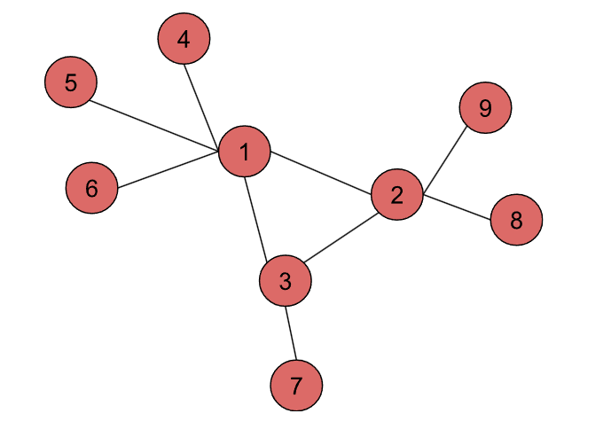

# Práctica Estrategias de Vacunación en Redes

## Objetivo

La figura muestra una red de contactos sexuales entre un grupo de personas, donde cada nodo representa a una persona y cada enlace representa una relación entre ellas.

El objetivo es reducir la transmisión de una enfermedad en esta red mediante la vacunación selectiva de individuos. Supondremos que, al vacunar a un individuo, se evita cualquier contagio a través de sus relaciones directas. Definimos el número de relaciones inmunizadas de un nodo vacunado como el número de sus vecinos.

Se asume que solo **se dispone de una vacuna** y que se busca maximizar el número de relaciones inmunizadas.

## Instrucciones

En un **notebook** contesta a las siguientes cuestiones;

1. Si se conoce de antemano la estructura completa de la red de ejemplo, ¿a qué persona vacunaría para maximizar las relaciones inmunizadas? Explique su elección.

2. Supón que desconocemos la estructura de la red. Seguimos una estrategia de vacunación aleatoria, que consiste en seleccionar *un individuo* al azar y vacunarlo. Programa un pequeño script en Python que **simule esta estrategia un número $T$ de veces** en la red de contactos propuesta y calcule el número esperado de relaciones inmunizadas:

   $E[I] = \frac{1}{T} \sum_{t=1}^T I_{t}$

3. Supón nuevamente que desconocemos la estructura de la red. Ahora seguimos una estrategia de vacunación denominada "aleatoria indirecta", que consiste en elegir **un individuo** al azar y vacunar a **uno de sus vecinos** seleccionado también al azar. Programa un pequeño script en Python que simule esta estrategia $T$ veces en la red de contactos propuesta y calcule el número esperado de relaciones inmunizadas.

4. ¿Cuál de las dos estrategias (aleatoria o aleatoria indirecta) parece ser mejor? Explica tu respuesta basándose en el concepto del "Paradojo de la amistad"[1].

En un **script** de Python:

5. Implementa una función `random_vaccine(G)` que tenga como argumento una red $G$ y devuelva el valor esperado del número de relaciones inmunizadas para la estrategia de vacunación aleatoria. 

6. Implementa una función `indirect_random_vaccine(G)` que tenga como argumento una red $G$ y devuelva el valor esperado del número de relaciones inmunizadas para la estrategia de vacunación aleatoria indirecta. 

Los valores de ambas funciones se pueden obtener directamente conocida la red sin necesidad de recurrir a simulación de Montercarlo. Puedes comparar los resultados que obtines con estas funciones con los obtenidos mediante simulación anteriormente.

## Entregable

Sube al repositorio el archivo del notebook Jupyter (.ipynb) y el script `assignment.py`, asegurándote de que todas las celdas de código estén ejecutadas y los resultados visibles. Incluye explicaciones breves en texto donde sea necesario.

## Evaluación y temporalización 

Al realizar un `push` al repositorio, se ejecutarán tests automáticos de evaluación que aportarán una puntuación de 50 sobre 100. Los 50 puntos restantes corresponderán a la evaluación manual del notebook, considerando la precisión del código, su organización, claridad en la documentación, calidad de las visualizaciones y la capacidad para justificar e interpretar los resultados. La fecha límite será la indicada en la tarea de Moodle, y los envíos retrasados estarán sujetos a una penalización del 30% de la nota total.

[1] **Referencia**: La lectura del artículo "The friendship paradox" permite comprender por qué una de las estrategias de vacunación puede ser más efectiva.

