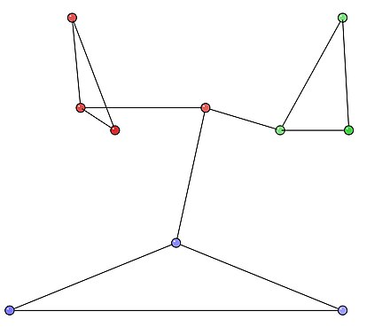
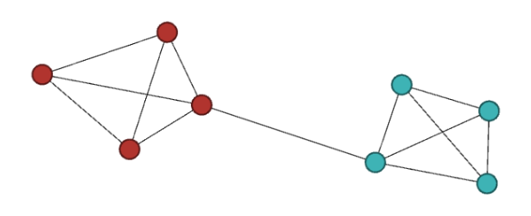

# Práctica Modularidad y Detección de Comunidades

## Objetivo

El objetivo de esta práctica es comprender el concepto de modularidad, implementando una función para calcularla, y el probelma de detección de comunidades, implementando una aproximación del algortimo de detección de Girvan-Newman.

## Instrucciones

### 1. Modularidad

Implementa en el script de python `assignment.py` una función `modularity` que reciba como argumentos:
- Un objeto `Graph` de NetworkX
- Una lista de conjuntos de nodos, donde cada conjunto recoge los nodos de una comunidad semajante a [ \{n1,n2,..\}, \{n4,n7,..\},...]

La función debe devolver el valor de la modularidad $Q$, calculado mediante la fórmula:

$Q = \frac{1}{2m} \sum_{i, j} \left[A_{ij} - \frac{k_i k_j}{2m}\right]\delta(c_i, c_j)$

donde:
- $A_{ij}$: elemento de la matriz de adyacencia de la red
- $k_i, k_j$: grados de los nodos $i$ y $j$
- $m$: número total de enlaces en la red
- $\delta(c_i, c_j)$: 1 si los nodos $i$ y $j$ están en la misma comunidad, 0 en caso contrario

También se puede utilizar la expresión de la modularidad siguiente que mira enlaces y extremos de enlace de las comunidades:

$Q = \sum_{u} \left[e_{uu} - a_{u}^{2}\right]$

donde:
- $e_{uu}$: fracción de enlaces con ambos vértices en la comunidad u-ésima
- $a_{u}$: fracción de extremos en la comunidad u-ésima

#### 1.2 Ejemplos para comporbar

Verifica el funcionamiento de tu función con los siguientes ejemplos:

1. **Ejemplo de Wikipedia**: utiliza la red de Wikipedia con la partición de colores. El valor esperado de la modularidad es $Q = 0.4896$

2. **Ejemplo de clase**:
   - Partición correspondiente a toda la red como un solo grupo: $Q = 0$
   - Partición donde cada nodo es su propia comunidad: $Q = -0.1272$
   - Partición de colores: $Q = 0.4231$

### 2. Detección de comunidades basada en eliminación de enlaces

#### 2.1 Implementación del algoritmo

Implementa en el script de python `assignment.py` una función `girvan_newman_communities` que desarrolle el algoritmo de Girvan-Newman para detectar comunidades de acuerdo a los siguientes pasos:
1. Calcular la betweenness de todas los enlaces de la red
2. Eliminar el enlace con mayor betweenness
3. Recalcular la betweenness para el resto de los enlaces
4. Repetir los pasos 2 y 3 hasta que no queden enlaces en el grafo

Después de 2, si se produce un “split” de la red (se rompe la red en varios componentes), se calcula la modularidad de la partición de la red original (donde las comunidades corresponden a los componentes de este split) y se almacena su valor. 

La función tiene como argumento un objeto Graph de NetworkX, y devuelve:
- La partición con el mayor valor de modularidad
- El valor de modularidad correspondiente
- Una lista con los valores de modularidad calculados en cada paso con "split" (el orden de la lista se corresponde con la secuancia del algoritmo)

Nota: emplea la función de modularidad implementada anteriormente. Si no consigues implementarla correctamente, puedes utilizar la función de Networkx [modularity](https://networkx.org/documentation/stable/reference/algorithms/generated/networkx.algorithms.community.quality.modularity.html)

#### 2.2 Validación con "Zachary’s Karate Club"

En un notebook de Jupyter pon a prueba tu algoritmo de Girvan-Newman utilizando la red `Zachary’s Karate Club` de NetworkX. Realiza lo siguiente:
1. Genera un gráfico que represente la red particionada, utilizando colores para diferenciar las comunidades detectadas
2. Genera un gráfico que muestre la evolución de la modularidad (ordenadas y) en función del número del "split" (abcisas x)

## Entregable

Sube al repositorio el archivo del notebook Jupyter (.ipynb) y el script `assignment.py`, asegurándote de que todas las celdas de código estén ejecutadas y los resultados visibles. Incluye explicaciones breves en texto donde sea necesario.

## Evaluación y temporalización 

Al realizar un `push` al repositorio, se ejecutarán tests automáticos de evaluación que aportarán una puntuación de 60 sobre 100. Las funciones implementadas deben ser propias, no se debe utilizar las funciones correspondientes de NetworkX que calculan la modularidad o la detección de comunidades. Los puntos restantes corresponderán a la evaluación manual del notebook, considerando la precisión del código, su organización, claridad en la documentación, calidad de las visualizaciones y la capacidad para justificar e interpretar los resultados. La fecha límite será la indicada en la tarea de Moodle, y los envíos retrasados estarán sujetos a una penalización del 30% de la nota total.

## Referencias

- **Edge betweenness centrality:** [documentación](https://networkx.org/documentation/stable/reference/algorithms/generated/networkx.algorithms.centrality.edge_betweenness_centrality.html)
- **Connected components:** [documentación](https://networkx.org/documentation/stable/reference/algorithms/generated/networkx.algorithms.components.connected_components.html)
- **Zachary’s Karate Club:** [documentación](https://networkx.org/documentation/stable/reference/generated/networkx.generators.social.karate_club_graph.html)

