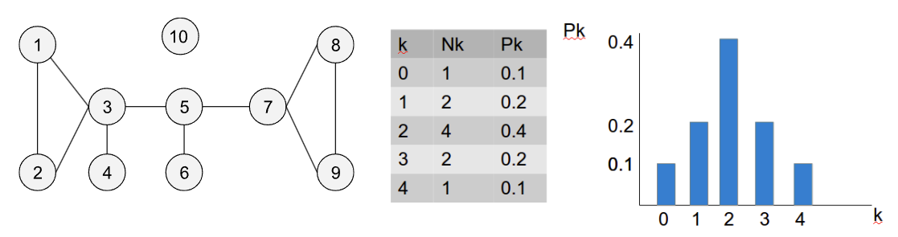
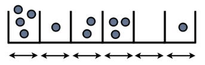
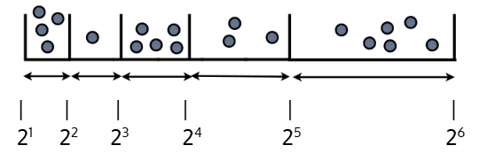
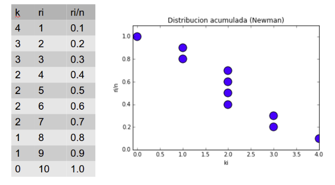

# Práctica Distribuciones Power Law

## Objetivo
El objetivo de esta práctica es comprender y analizar las distribuciones Power Law en redes, utilizando herramientas computacionales para estudiar sus propiedades y evaluar cómo se comportan las distribuciones de grado en diferentes tipos de redes.

## 1. Distribución de grado

La distribución de grado $p_k$ indica la probabilidad de que un nodo seleccionado al azar en una red tenga un grado $k$. En una red con $N$ nodos, si $N_k$ nodos tienen grado $k$, entonces podemos definir $p_k$ como:

$p_k = \frac{N_k}{N}$

A continuación, se presenta la distribución de grado para un ejemplo sencillo (tabla y representación como histograma):



En redes dirigidas, se consideran dos distribuciones de grado: **in-degree** (entradas) y **out-degree** (salidas).

## 2. Distribuciones Power Law

Para comprender el concepto de distribuciones Power Law en redes recomendamos la lectura del capítulo [The Scale-Free Property](https://www.networksciencebook.com/chapter/4) del libro [Network Science](https://www.networksciencebook.com/) de Barabasi.

## 3. Estudio de la distribución de grado de una red

Se propone analizar la distribución de grado de una red de routers de Internet (que se encuentra en la carpeta dataset) utilizando la librería **NetworkX** de Python. Como esta librería no es adecuada para visualizar redes grandes, no se intentará generar la representación completa de la red. 

El objetivo es comprobar si la distribución de grado sigue una Power Law y determinar el parámetro que la define, utilizando dos técnicas diferentes. Se pide completar un notebook de Jupyter el análisis de la red que describimos a continuación.

### 3.1 Estadísticas básicas

Calcula las siguientes estadísticas de la red:

- Número total de nodos
- Número total de enlaces
- Grado medio
- Grado máximo
- Grado mínimo

### 3.2 Histograma de distribución de grado

Dibuja un histograma de la distribución de grado de la red. Utiliza la función:

```python
matplotlib.pyplot.hist(x, bins, density=True)
```
Cambia la escala de los ejes a logarítmica (usando las funciones `matplotlib.pyplot.yscale` y `xscale`) y determina la escala más adecuada para visualizar la distribución. Si se observa un comportamiento lineal significativo en escala logarítmica, es probable que la distribución siga una Power Law.

### 3.3 Histograma con clases variables logarítmicas

El histograma anterior utiliza clases de tamaño constante, lo cual puede generar ruido en distribuciones Power Law debido a que las clases de mayor grado contienen muy pocos datos. 



Para resolver este problema, utiliza clases de tamaño variable, como las clases logarítmicas:



El tamaño de la clase n-ésima es $2^{n-1}<k<2^{n}$, y el número de clases necesarias dependerá del grado máximo de la red (n tiene que ser suficientemente grande para recoger el grado máximo, pero no sobrepasarlo).

Puesto que los tamaños de las clases son diferentes es necesario **normalizar** la frecuencia de nodos en cada clase dividiéndola por el tamaño de la clase correspondiente; en el caso de la clase n-esima el tamaño es $2^{n}-2^{n-1}$

Para calcular la frecuencia de casos por clase logarítmics se puede utilizar:

```python
numpy.histogram(a, bins=[2^1,2^2,...,2^n], density=False)
```

Puede dibujar el histograma podemos utilizar un diagrama de barras donde la altura de cada barra corresponde a la frecuencia normalizada de cada clase y la anchura de la barra al tamaño de la clase, jugando con los argumentos `left`, `height` y `width` de la función de matplotlib:

```python
matplotlib.pyplot.bar(left, height, width)
```

Recuerda que para visualizar correctamente este diagrama de barras deberemos utilizar escala logarítmica en los ejes.

### 3.4 Estimación del parámetro de Power Law

Queremos calcular el parámetro $\alpha$ que define la Power Law:

$p_k \sim k^{-\alpha}$

Para ello, ajustamos un modelo de regresión lineal a los datos transformados logarítmicamente. El parámetro de pendiente corresponderá a $\alpha$:

$Log(p_k) = -\alpha Log(k) + c$

Podemos utilizar:

```python
scipy.stats.linregress(x, y)
```

Que nos devuelve la pendiente (valor $\alpha$ buscado), el coeficiente de determinación $R^2$ y el p-valor del ajuste, para evaluar la calidad del ajuste.

### 3.5 Estimación mediante distribución acumulada

La distribución acumulada de grado se define como:

$P_k = \sum_{k'=k}^{\inf} p_{k'}$

Para obtener esta distribución:

1. Ordena los grados de los nodos de forma decreciente
2. Asigna un ranking acumulativo
3. Divide cada valor de ranking por el número total de nodos



Ajusta un modelo de regresión lineal a los datos de esta distribución acumulada (**transformados logarítmicamente**). En este caso, el exponente $\alpha$ que buscamos se relaciona con el la pendiente de esta recta ajustada:

$\alpha = \text{pendiente} + 1$


## Entregable

Sube al repositorio el archivo del notebook Jupyter (.ipynb), asegurándote de que todas las celdas de código estén ejecutadas y los resultados visibles. Incluye explicaciones breves en texto donde sea necesario.

## Evaluación y temporalización 

La evaluación manual del notebook tendrá en cuenta la precisión del código, su organización, claridad en la documentación, calidad de las visualizaciones y la capacidad para justificar e interpretar los resultados. La fecha límite será la indicada en la tarea de Moodle, y los envíos retrasados estarán sujetos a una penalización del 30% de la nota total.

## Referencias
- Newman, M. (2010). *Networks: An Introduction*. Oxford University Press (Capítulo 8).


